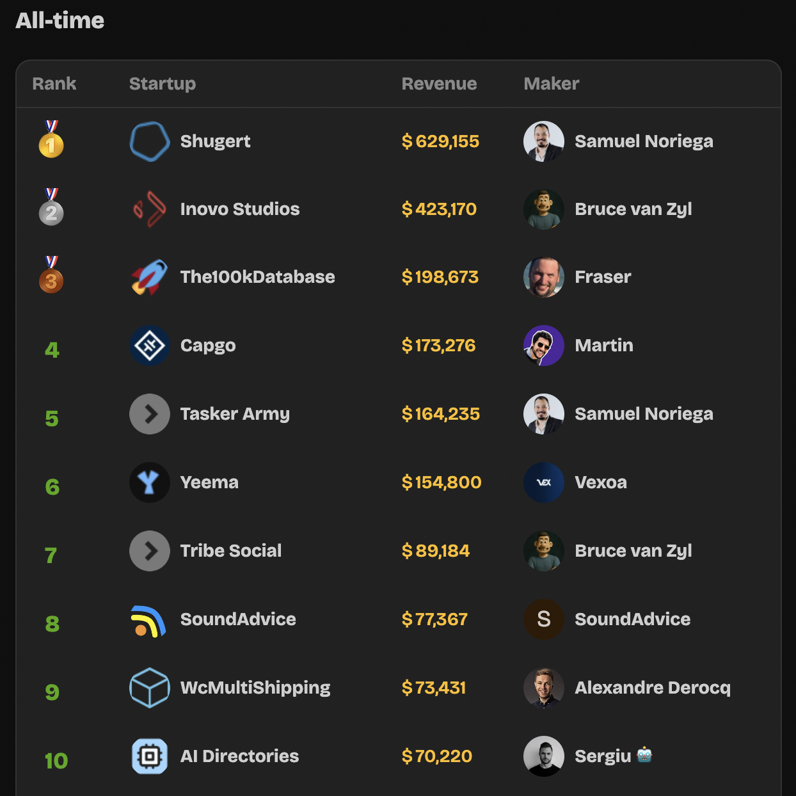
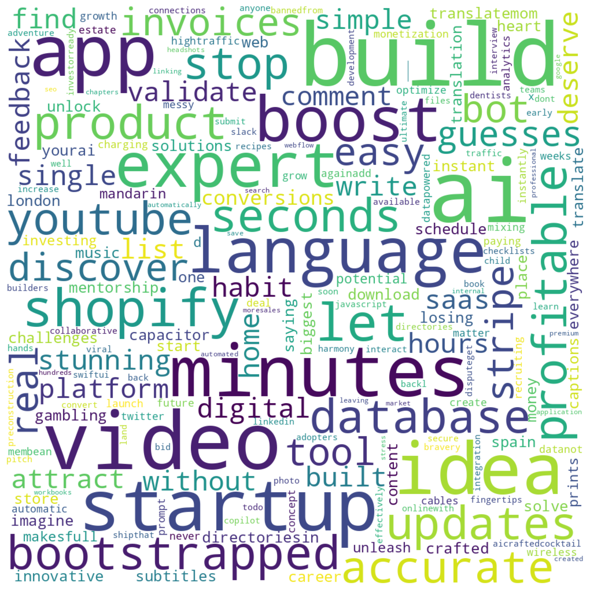
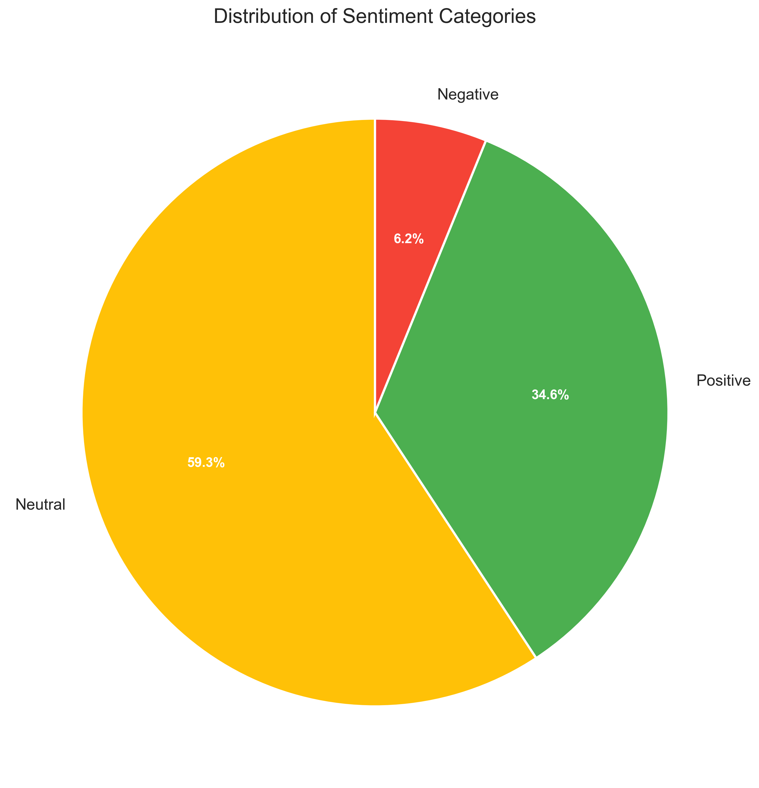
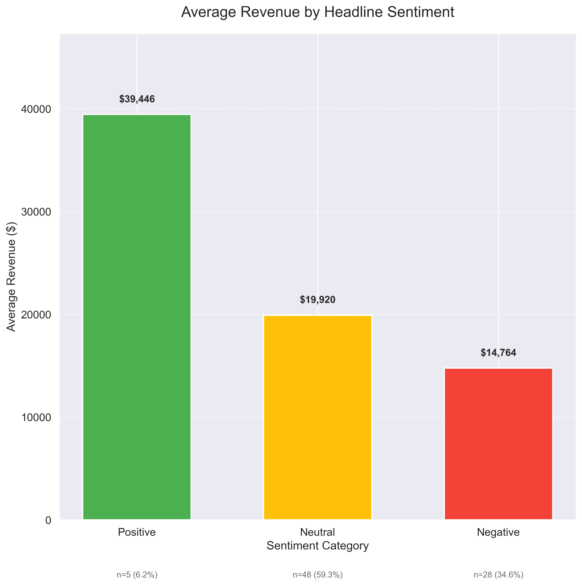
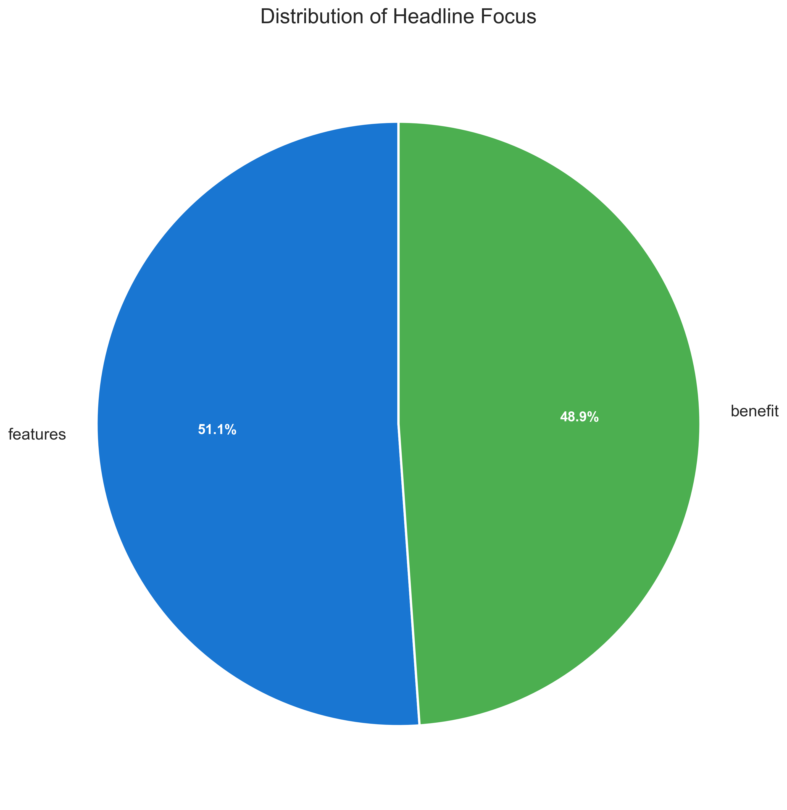
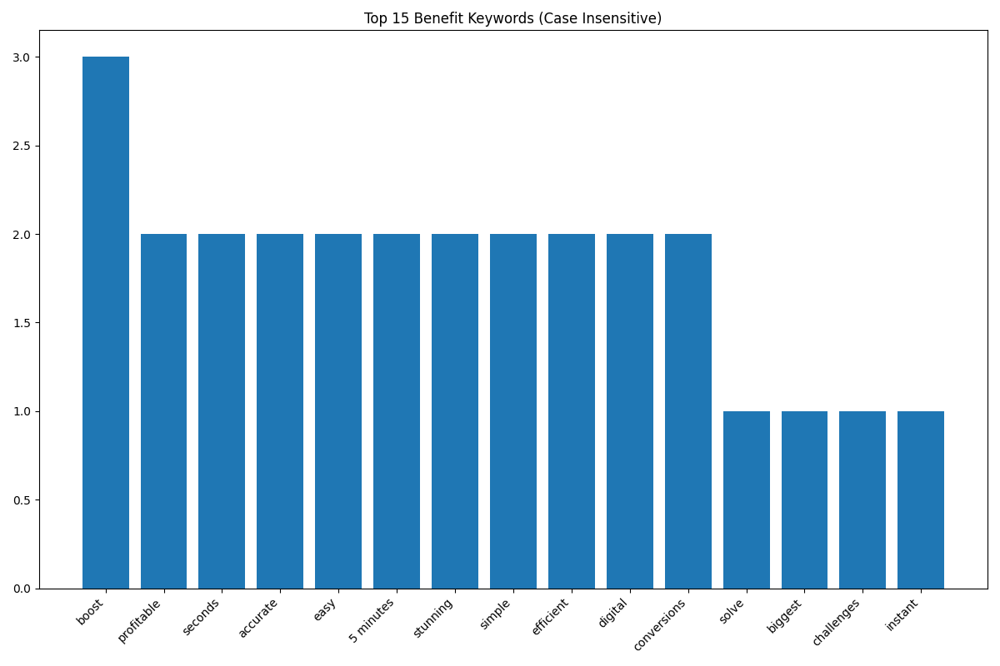
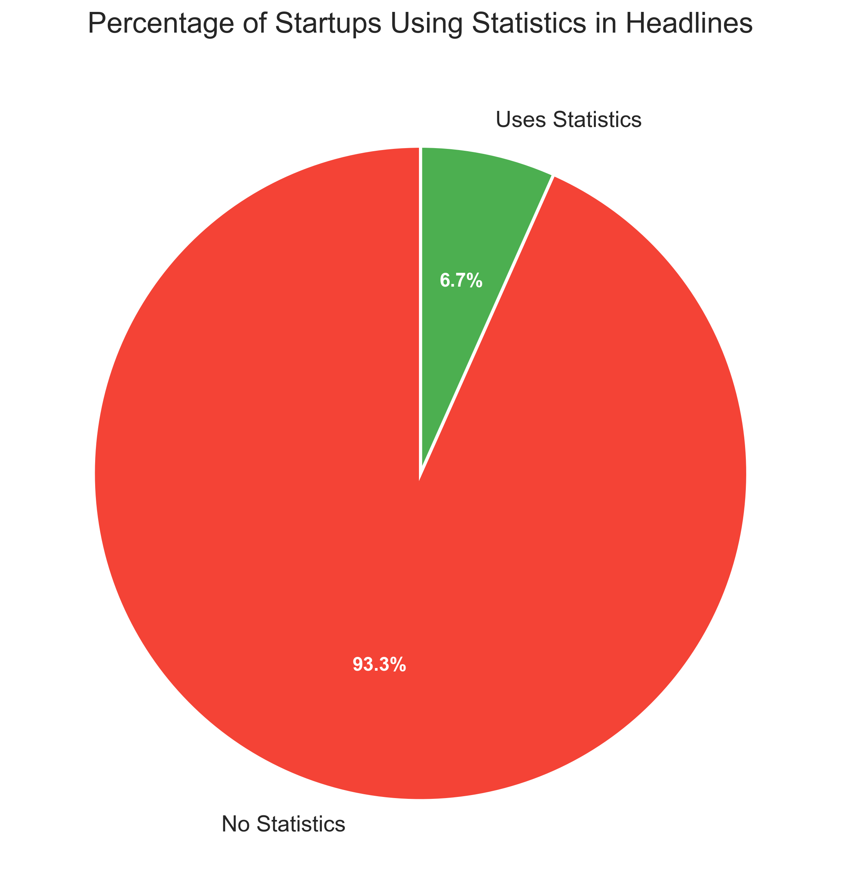
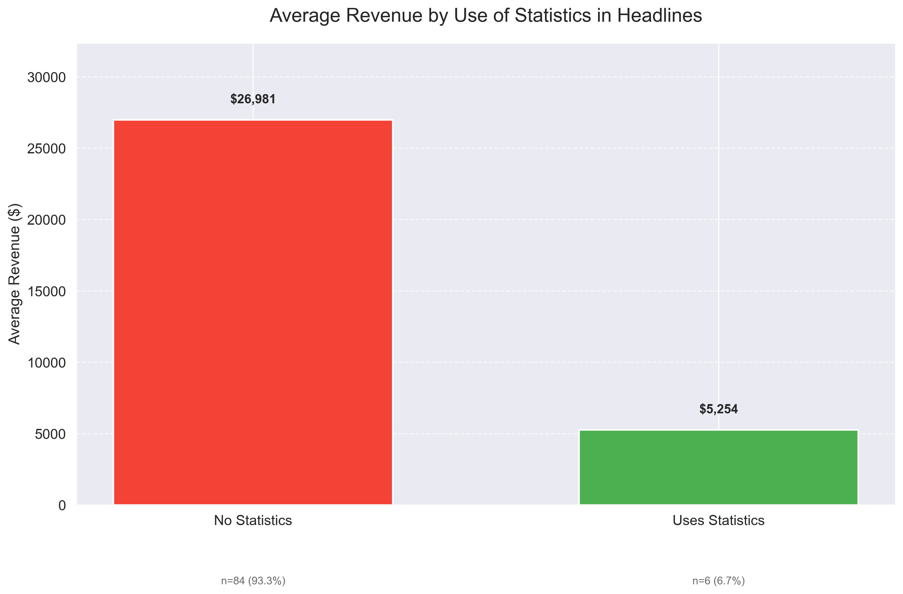
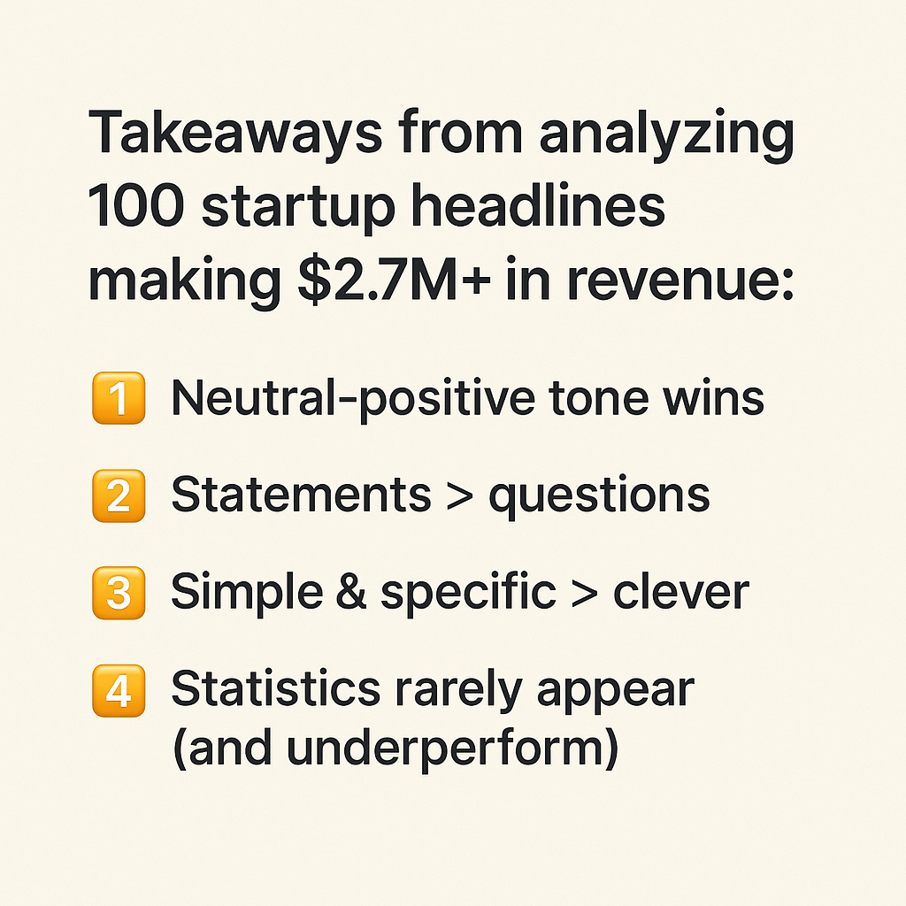

### Tweet 1
Your SaaS's headline is the first thing most customers will see.

I dissected the top 100 startups on @marc_louvion's ShipFast leaderboard (collectively $2.7 M+ ARR) to uncover the headline formulas that convert.

Full thread with takeaways and 100 headline examples👇

### Tweet 2
Be confident but realistic about your product. Include industry trends.

Out of the 81 English headlines from top 100 startups, only 8 words showed up more than twice:

6x: build, ai
4x: app, videos, minutes, startup
3x: idea, boost

"Minutes" > "Instantly" (its more believable)

### Tweet 3
Data shows that the majority of successful headlines are neutral, and the rest are positive.

I ran sentiment analysis on the 81 English startup headlines:
- 59% neutral
- 35% positive
- 6% negative

Don't over-sell your product.
Don't market via fear.
Be realistic.

### Tweet 4
The most positive landing page headlines:
- "Craft Stunning Grids. Showcase Rich and Beautiful." - https://www.gridwow.me @joanboschpons ($1,171)
- "Create Stunning Videos Instantly with a Single Prompt." - https://www.bityclips.com @shibley ($11,286)

(inlcude screenshots of headlines)
### Tweet 5
The most negative landing page headlines:
- "Stop losing money gambling, start investing" - https://arbi.chat @paletmiki ($49,387)
- "Don't let a dispute get you banned from Stripe" - https://byedispute.com/ @marc_louvion ($5,748)

(include screenshots of headlines)
### Tweet 6
Use statements, not questions. 
Statements project authority, questions invite doubt.

ZERO of the top 100 ShipFast startups used a question as their headline. Every single one was a statement.

### Tweet 7
I asked ChatGPT to label each headline as either feature-focused (e.g. “Generate videos with AI”) or benefit-focused (e.g. “Grow faster with AI-generated videos”).

Result: it barely matters.

Benefit-driven headlines were 48.9% of the total and brought in 49.7% of revenue.

Slight edge, not a silver bullet.

### Tweet 8
I had ChatGPT extract the top “benefit keywords” from each headline.

Most common:
boost, profitable, seconds, accurate, easy, stunning, simple, efficient, digital, conversions

Speed, clarity, and outcomes dominate.

### Tweet 9
Data usually beats opinion - but not when its in the headline.

I had ChatGPT identify which headlines included statistics  (ex: "46% of Google Search is Local" - https://shiplocal.directory @mattmerrick16 $2,346).

Only 6 of the top 100 used statistics. On average, they made 80% less revenue than those that didn’t.

### Tweet 10
Theme 1: Speed and Simplicity

Headlines that sell ease and speed

- "Chapters for YouTube videos in seconds, not hours!"
- "Idea to viral videos in 2 minutes."
- "Schedule your content everywhere in seconds"

### Tweet 11
Theme 2: Niche Targeting

Specificity wins trust

- "Shopify Experts in Spain"
- "Digital collaborative checklists for dentists and their teams"
- "SwiftUI App Development with Secure AI Integration

### Tweet 12
Theme 3: Functional Clarity

No fluff, just direct value

- "Convert your files"
- "Submit Your Startup to 100+ Directories"
- "Translate Youtube Videos, Get Captions, Subtitles"

### Tweet 13
Takeaways from analyzing 100 startup headlines making $2.7M+ in revenue:

The best headlines are clear promises delivered with confidence.

### Tweet 14
I took the top 25 headlines and used them to set up a multi-shot prompt to generate headlines for landing pages for all of the 'Request For Startup' ideas from Y Combinator.

Results here:

If you made it this far:
1. Follow if you want more breakdowns like this (I have some cool stuff in the works)
2. Reply with your startup and I’ll generate headline ideas using the multi-shot prompt